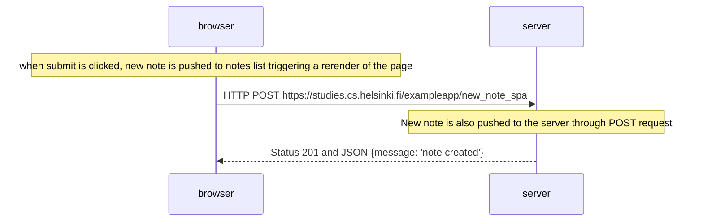

```mermaid
sequenceDiagram
participant browser
participant server
note over browser: when submit is clicked, new note is pushed to notes list triggering a rerender of the page
browser->>server: HTTP POST https://studies.cs.helsinki.fi/exampleapp/new_note_spa
note over server: New note is also pushed to the server through POST request 
server-->>browser: Status 201 and JSON {message: 'note created'}

```
